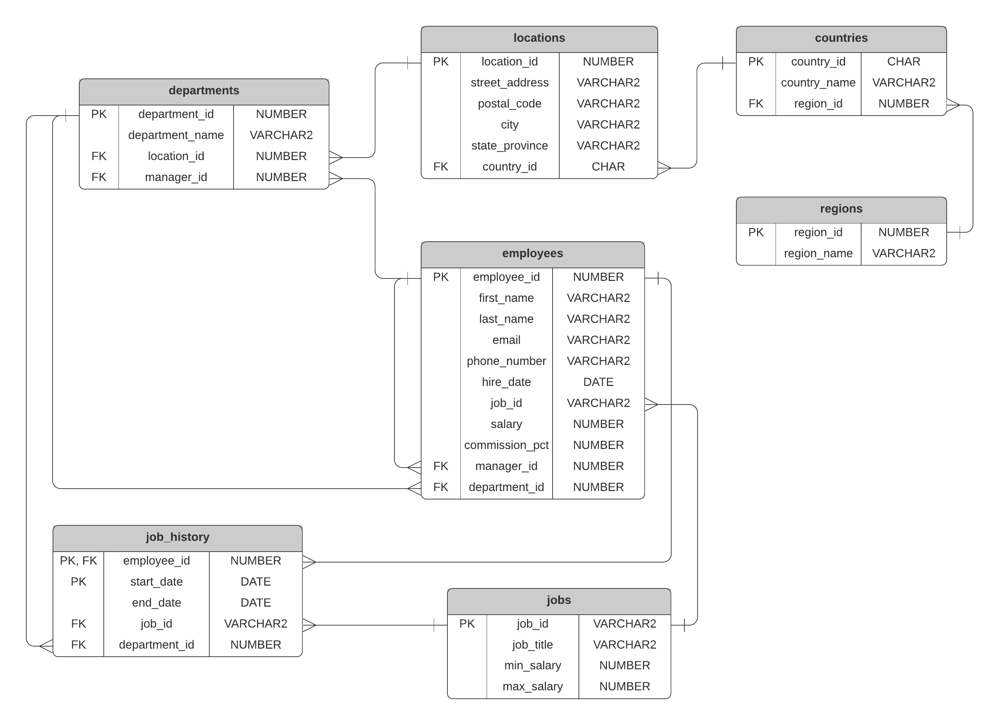

# Oracle Sample HR Schema

## Steps

To create this schema on your database:
1. Run script 01 to create the tables.
2. Run script 02 to populate the tables.

The schema is now set up!

## ERD

Here's the ERD of the HR schema used:

#### Complete hr_sample_use_cases_part_1 and hr_sample_use_cases_part_2 queries
