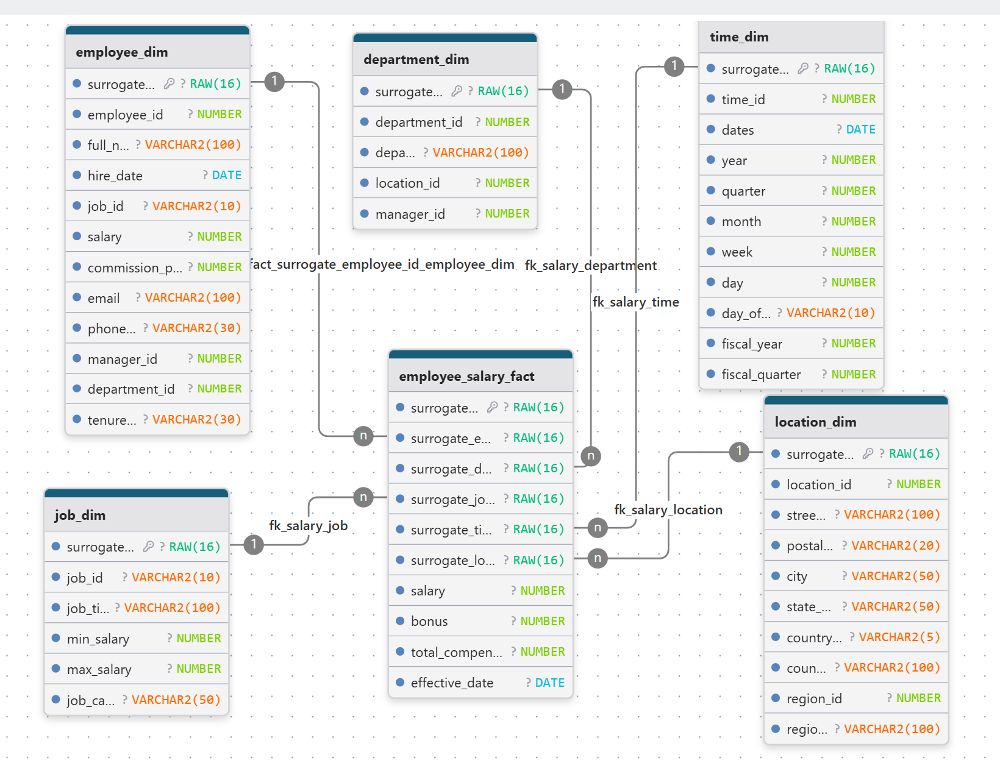

## Slowly Changing Dimensions (SCD Type 2)

This project includes a full implementation of Slowly Changing Dimensions Type 2 (SCD2) for all dimension tables:
- `employee_dim`
- `department_dim`
- `job_dim`
- `location_dim`

### Purpose
SCD Type 2 allows tracking historical changes in dimensional attributes while preserving previous versions of records.

### 🛠️ Logic Details
The SCD2 process includes:

1. **Initial Setup**
   - All records are marked with `is_current = 'Y'` and assigned an `effective_start_date`.
   - `effective_end_date` remains `NULL` for current records.

2. **Change Detection & Versioning**
   - Each dimension uses a SELECT from the OLTP source table (`employees`, `departments`, etc.) as its staging input within the `MERGE` logic.
   - A `MERGE` operation compares incoming records to existing current records (`is_current = 'Y'`).
   - If changes are detected:
     - Existing record is expired (`is_current = 'N'`, `effective_end_date = SYSDATE`).
     - A new version is inserted with updated values and `is_current = 'Y'`.
   - If no current record exists, a new record is inserted directly.

3. **Surrogate Keys**
   - Surrogate keys are generated using `ORA_HASH()` based on business key attributes.
   - These ensure uniqueness and efficient joins.
   - Primary keys remain on the surrogate ID fields for each dimension.

4. **Reusable & Safe**
   - Logic is modular and safe to re-run without duplication.
   - The process is fully repeatable and incremental.

## Schema

