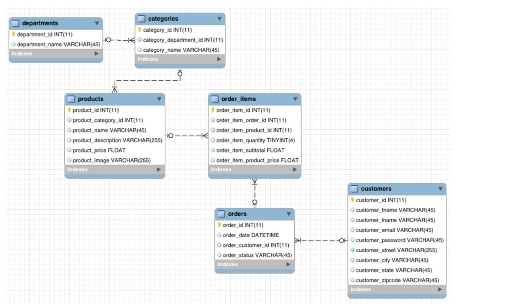

# Retail Database Load & Usage Guide

This repository contains SQL scripts and resources for loading and analyzing a retail database schema.

---

## ⚡ Load Sequence

Unzip `sql_scripts.zip` and place all .sql scripts in the C:\tmp directory (Windows) and run the following scripts in order from your SQL*Plus session:

```sql
@C:\tmp\01_ddl.sql
@C:\tmp\02_load_departments.sql
@C:\tmp\03_load_categories.sql
@C:\tmp\04_load_products.sql
@C:\tmp\05_load_customers.sql
@C:\tmp\06_load_orders.sql
@C:\tmp\07_load_order_items.sql
```


---

## 🗂 Schema Overview

Below is the schema diagram for the retail database:



---


## ✅ Validation

After loading, verify record counts:

```sql
SELECT COUNT(*) FROM departments;
SELECT COUNT(*) FROM categories;
SELECT COUNT(*) FROM products;
SELECT COUNT(*) FROM customers;
SELECT COUNT(*) FROM orders;
SELECT COUNT(*) FROM order_items;
```

---

## 📊 Next Steps: Analytics Use Cases

Refer to the notebook **`38_oracle_sql_data_analytics_retail_schema_01.ipynb`**   for analytics examples and use cases and solve them