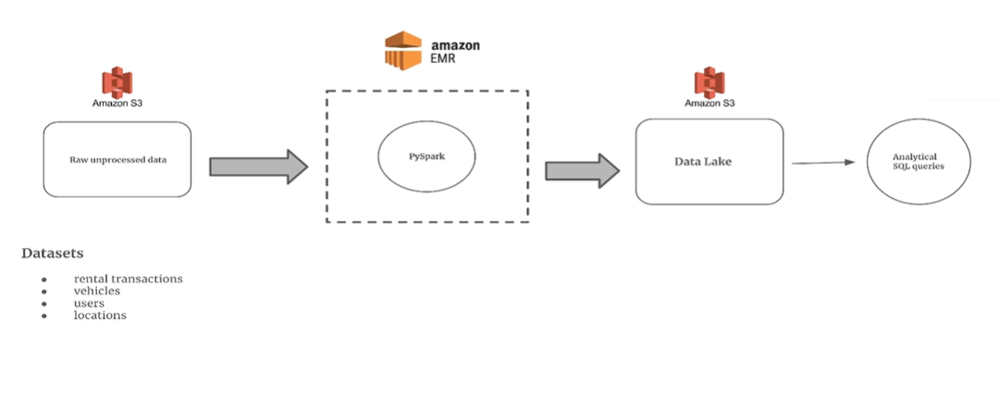

# 🚗 Team_1_CODE_FLUX – Rental Data Pipeline



## 📘 Project Overview
This project implements a **big data processing pipeline** for a vehicle rental marketplace.  
It demonstrates how to design and orchestrate an end-to-end workflow using the AWS ecosystem — combining **data ingestion, transformation, and analytics** within a unified pipeline.

The system processes multiple datasets:
- **Vehicles** – Details of all vehicles available for rent  
- **Users** – Registered customers on the platform  
- **Locations** – Master dataset containing pickup and drop-off points  
- **Rental Transactions** – Records of all rental activity including start date, end date, vehicle ID, pickup/drop-off locations, and total amount

---

## 🧩 Objectives
To **aggregate and transform** raw data stored in Amazon S3 into meaningful metrics using Spark on AWS EMR, and make it **queryable via Athena**.  
The project showcases:
- Efficient data storage in S3 (raw → processed zones)  
- Data processing using EMR and PySpark  
- Metadata management via AWS Glue Crawlers & Data Catalog  
- Interactive querying through Amazon Athena  
- Workflow orchestration using AWS Step Functions  

---

## ⚙️ Tech Stack
| Component | Purpose |
|------------|----------|
| **Amazon S3** | Storage layer & data lake for raw and processed data |
| **AWS EMR (PySpark)** | Executes Spark-based data transformation jobs |
| **AWS Glue Crawlers & Data Catalog** | Infers schema and registers tables |
| **Amazon Athena** | Enables SQL-based analysis over S3 data |
| **AWS Step Functions** | Orchestrates and automates the EMR workflow |

---

## 🧠 Workflow Summary
1. Upload all source datasets into the **S3 raw zone**.  
2. Use **Step Functions** to trigger Spark jobs on EMR.  
3. Spark transforms the data and writes results to the **processed zone** in S3.  
4. **Glue Crawlers** extract metadata from processed data and update the Data Catalog.  
5. **Athena** queries the data for business insights (rental trends, utilization, revenue, etc.).  
6. Step Functions automatically **terminate the EMR cluster** after successful execution.

---

## 🗂️ Repository Structure
```
Team_1_CODE_FLUX_Rental_Data_Pipeline/

TBA
```

---

## 🧩 Sprint Overview
| Sprint | Focus Area | Key Deliverables |
|---------|-------------|------------------|
| **Sprint 1 – AWS Setup & Initialization** | Configure S3 structure, upload datasets, and verify connectivity | S3 buckets created, raw data uploaded |
| **Sprint 2 – Pipeline Development & Execution** | Develop and test PySpark jobs on EMR | Working Spark ETL jobs, Step Function flow |
| **Sprint 3 – Integration, Testing & Demo** | Integrate Glue, Athena, and finalize automation | Complete end-to-end workflow with Athena queries |

---

## 📋 JIRA Board
Project tracking and sprint progress are maintained in the dedicated JIRA board:  
🔗 [Team_1_CODE_FLUX – Rental Data Pipeline JIRA Board](https://nagabhushanm.atlassian.net/jira/software/projects/REN/boards/3)

---

## 🧑‍💻 Contributors
**Team 1 – CODE FLUX**  
- Vijay Kumar E  
- Smita Sudhakar Hegde  
- Sakshath K Shetty  
- Mallika Shree K C  
- Gokul Raj S  

---

### 📸 Image Placeholder
Add your architecture diagram or workflow visualization here:
```
images/architecture.png
```

---

### 🏁 Maintainer
**Repository Owner:** [@nagabhushan1](https://github.com/nagabhushan1)
