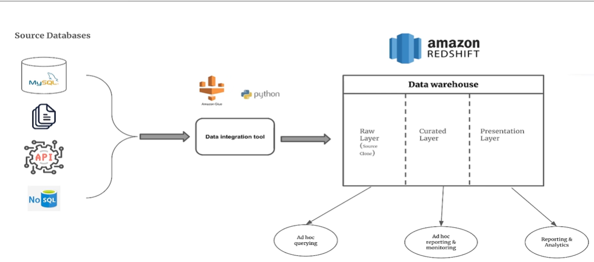

# 🛒 Team_2_APEX – Retail Lakehouse



## 📘 Project Overview
This project implements a **Lakehouse architecture** on AWS for e-commerce transaction data.  
It demonstrates how to use **Delta Lake with Spark** to unify the benefits of data lakes and data warehouses, creating a simplified, scalable, and reliable analytics platform.

The **Retail Lakehouse** integrates multiple AWS services — Glue, S3, Athena, and the Data Catalog — to create a unified data environment that supports both analytical and operational workloads.

---

## 🧩 Objectives
To design and implement a **data lakehouse architecture** that unifies transactional, inventory, and customer data into a single analytical system for business reporting and analysis.  
The project showcases:
- Data ingestion and transformation with **AWS Glue (Delta Lake)**  
- Storage and schema management using **S3 and Glue Data Catalog**  
- Query and analysis through **Amazon Athena**  
- Metadata automation and data discovery via **Glue Crawlers**  

---

## ⚙️ Tech Stack
| Component | Purpose |
|------------|----------|
| **Amazon S3** | Centralized storage for raw and transformed data |
| **AWS Glue (Delta Lake)** | Performs ETL and builds Delta tables |
| **AWS Glue Crawlers & Data Catalog** | Manages table schema and metadata |
| **Amazon Athena** | Executes SQL queries on curated Delta tables |

---

## 🧠 Workflow Summary
1. Load raw transactional data into **S3 (raw zone)**.  
2. Use **Glue Spark jobs** to clean, deduplicate, and build **Delta tables**.  
3. Write transformed data into **S3 (curated zone)**.  
4. **Glue Crawlers** extract schema from curated Delta tables and update the Data Catalog.  
5. **Athena** queries the curated tables to generate insights and dashboards.

---

## 🗂️ Repository Structure
```
Team_2_APEX_Retail_Lakehouse/

TBA

```

---

## 🧩 Sprint Overview
| Sprint | Focus Area | Key Deliverables |
|---------|-------------|------------------|
| **Sprint 1 – AWS Setup & Initialization** | Configure S3 zones, create Glue jobs, and prepare Data Catalog | S3 structure and Glue setup completed |
| **Sprint 2 – Pipeline Development & Execution** | Build Delta Lake ETL jobs and test Athena queries | Working Delta tables and query results |
| **Sprint 3 – Integration, Testing & Demo** | Integrate Glue Crawlers and finalize Athena reporting | Complete Lakehouse workflow with automation |

---

## 📋 JIRA Board
Project tracking and sprint progress are maintained in the dedicated JIRA board:  
🔗 [Team_2_APEX – Retail Lakehouse JIRA Board](https://nagabhushanm.atlassian.net/jira/software/projects/RET/boards/4)

---

## 🧑‍💻 Contributors
**Team 2 – APEX**  
- Sayyam K Nahar  
- Yashaswini D S  
- Nikhil Hitnalli  
- Priyanka D L  
- Tinku Kumar  

---

### 📸 Image Placeholder
Add your architecture diagram or workflow visualization here:
```
images/architecture.png
```

---

### 🏁 Maintainer
**Repository Owner:** [@nagabhushan1](https://github.com/nagabhushan1)
