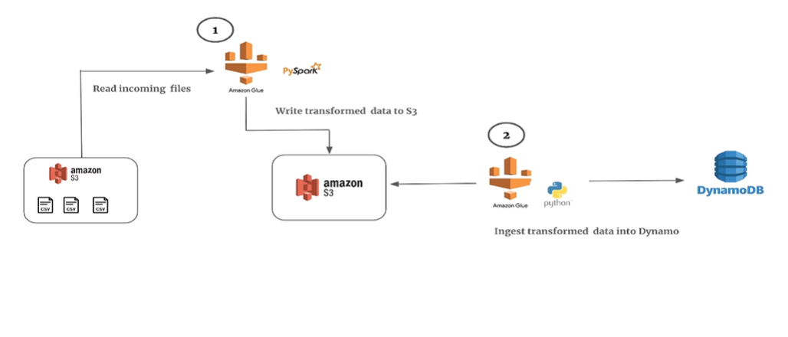

# 🎵 Team_3_CLOUD_CODERS – Music Stream



## 📘 Project Overview
This project builds a **distributed ETL pipeline** for music streaming data using AWS.  
It demonstrates how to decouple **data orchestration** from **data transformation** efficiently using **Airflow**, **Glue**, and **DynamoDB**.

The goal is to process music stream data arriving in S3 at unpredictable intervals and deliver analytical metrics in near-real time to downstream microservices.

---

## 🧩 Objectives
To design and implement a **data pipeline** that handles real-time music streaming data using AWS services.  
The project showcases:
- Orchestration using **Apache Airflow**  
- Data transformation with **AWS Glue (PySpark and Python Shell)**  
- Metrics storage in **DynamoDB**  
- Reliable and cost-efficient architecture for continuous data availability  

---

## ⚙️ Tech Stack
| Component | Purpose |
|------------|----------|
| **Amazon S3** | Serves as the storage layer for raw and processed data |
| **Apache Airflow** | Manages orchestration and DAG execution |
| **AWS Glue (PySpark)** | Performs distributed data transformations |
| **AWS Glue (Python Shell)** | Executes lightweight post-processing tasks |
| **Amazon DynamoDB** | Stores final processed metrics for microservices |

---

## 🧠 Workflow Summary
1. Streaming data from a **music platform** arrives in S3 at irregular intervals.  
2. An **Airflow DAG** triggers the following sequence:  
   - Validate the incoming data structure and required columns.  
   - Execute a **Glue Spark job** to process and transform raw data.  
   - Run a **Glue Python Shell job** to load the transformed data into DynamoDB.  
   - Archive processed files in a separate S3 folder.  
3. This setup ensures near real-time metric availability while optimizing performance and cost.

---

## 🗂️ Repository Structure
```
Team_3_CLOUD_CODERS_Music_Stream/
TBA
```

---

## 🧩 Sprint Overview
| Sprint | Focus Area | Key Deliverables |
|---------|-------------|------------------|
| **Sprint 1 – AWS Setup & Initialization** | Configure S3 buckets, Airflow connection, and Glue environment | Airflow DAG structure created and tested |
| **Sprint 2 – Pipeline Development & Execution** | Develop Glue jobs (Spark and Python Shell) for ETL | Working ETL pipeline with S3 input/output |
| **Sprint 3 – Integration, Testing & Demo** | Integrate DynamoDB, validate results, and finalize orchestration | End-to-end pipeline automation with real-time updates |

---

## 📋 JIRA Board
Project tracking and sprint progress are maintained in the dedicated JIRA board:  
🔗 [Team_3_CLOUD_CODERS – Music Stream JIRA Board](https://nagabhushanm.atlassian.net/jira/software/projects/MUS/boards/5)

---

## 🧑‍💻 Contributors
**Team 3 – CLOUD CODERS**  
- Pavan Shetti  
- Trishala N P  
- Sanketh Shinde  
- Megha Singha Roy  
- Sudeep S  

---

### 📸 Image Placeholder
Add your architecture diagram or workflow visualization here:
```
images/architecture.png
```

---

### 🏁 Maintainer
**Repository Owner:** [@nagabhushan1](https://github.com/nagabhushan1)
