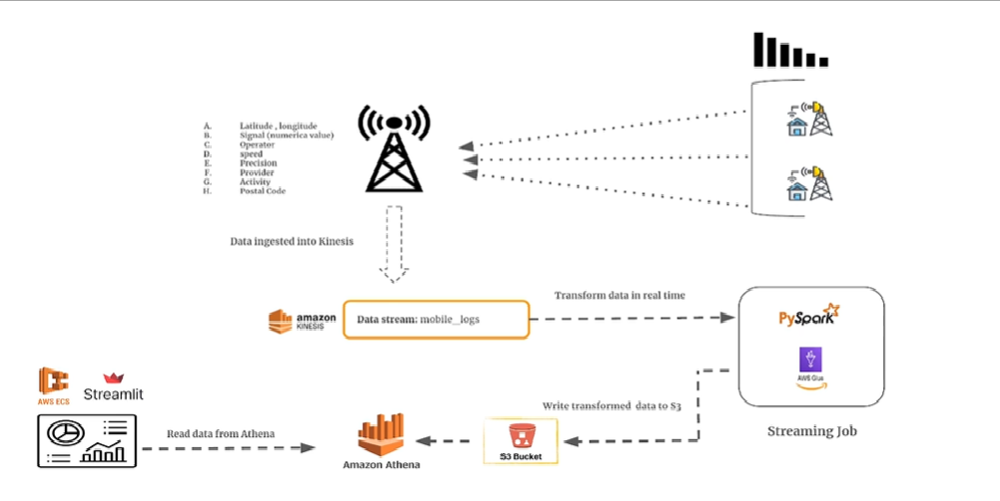

# 📶 Team_4_DATA_FORGE – Signal Stream



## 📘 Project Overview
This project focuses on building a **real-time data streaming and analytics pipeline** for a telecommunications company.  
It demonstrates how to use **AWS Glue (PySpark Streaming)**, **AWS Kinesis**, **Athena**, and **ECS** to process and visualize live network data.

The goal is to design a system that ingests continuous signal and network metrics from multiple providers, performs real-time transformations, and displays insights through an interactive Streamlit dashboard.

---

## 🧩 Objectives
To design and implement a **real-time data streaming pipeline** that captures, processes, and visualizes mobile network logs using AWS services.  
The project showcases:
- Real-time ETL using **AWS Glue Streaming (PySpark)**  
- Continuous data ingestion from **AWS Kinesis**  
- Query and analytics using **Amazon Athena**  
- Automated schema management with **Glue Crawlers**  
- Live dashboard deployment via **Streamlit on ECS**  

---

## ⚙️ Tech Stack
| Component | Purpose |
|------------|----------|
| **AWS Kinesis** | Real-time streaming source for network metrics |
| **AWS Glue (PySpark Streaming)** | Performs live data processing and transformations |
| **Amazon S3** | Serves as the data lake for raw and processed data |
| **AWS Glue Crawlers & Data Catalog** | Infers schema and maintains metadata for Athena |
| **Amazon Athena** | Runs SQL queries on processed data stored in S3 |
| **Amazon ECS (Streamlit)** | Hosts the live dashboard for data visualization |

---

## 🧠 Workflow Summary
1. Real-time data from telecom networks is streamed into **AWS Kinesis**.  
2. A **PySpark Streaming job** running on **AWS Glue** reads from Kinesis, transforms data, and writes results into **S3**.  
3. **Glue Crawlers** detect schema changes and update the **Data Catalog**.  
4. **Athena** queries processed data to extract metrics such as:  
   - Average signal strength by operator  
   - Average GPS precision by provider  
   - Count of network statuses by postal code  
5. A **Streamlit dashboard**, deployed on **Amazon ECS**, displays these metrics in near real-time and refreshes at defined intervals.

---

## 🗂️ Repository Structure
```
Team_4_DATA_FORGE_Signal_Stream/

TBA
```

---

## 🧩 Sprint Overview
| Sprint | Focus Area | Key Deliverables |
|---------|-------------|------------------|
| **Sprint 1 – AWS Setup & Initialization** | Create Kinesis stream, S3 structure, and configure Glue environment | Kinesis and S3 setup validated |
| **Sprint 2 – Pipeline Development & Execution** | Develop PySpark streaming job and integrate with Athena | Real-time data flow from Kinesis to S3 confirmed |
| **Sprint 3 – Integration, Testing & Demo** | Deploy Streamlit dashboard on ECS and automate schema updates | End-to-end streaming and visualization pipeline operational |

---

## 📋 JIRA Board
Project tracking and sprint progress are maintained in the dedicated JIRA board:  
🔗 [Team_4_DATA_FORGE – Signal Stream JIRA Board](https://nagabhushanm.atlassian.net/jira/software/projects/SIG/boards/6)

---

## 🧑‍💻 Contributors
**Team 4 – DATA FORGE**  
- Rakesh Kumar  
- Kavya Bhatta S  
- Ijaz Ahmad S  
- Sahana J Upadhyaya  

---

### 📸 Image Placeholder
Add your architecture diagram or workflow visualization here:
```
images/architecture.png
```

---

### 🏁 Maintainer
**Repository Owner:** [@nagabhushan1](https://github.com/nagabhushan1)
